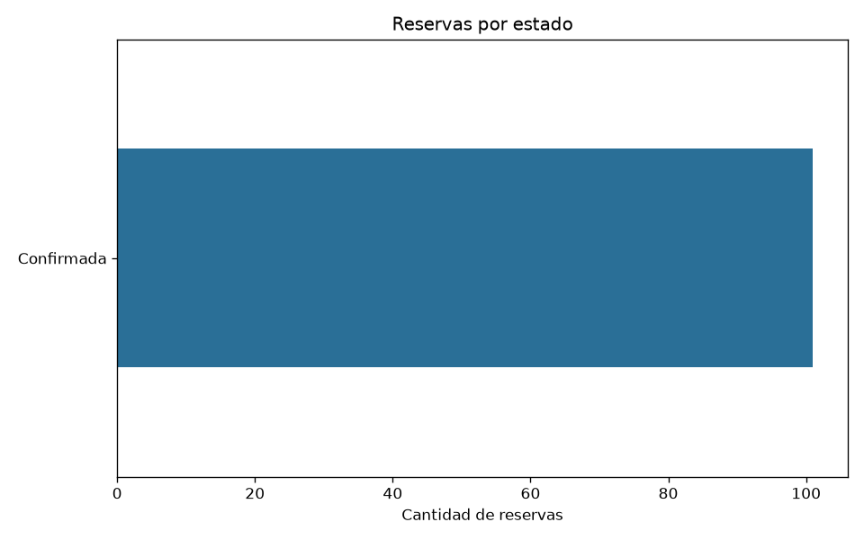
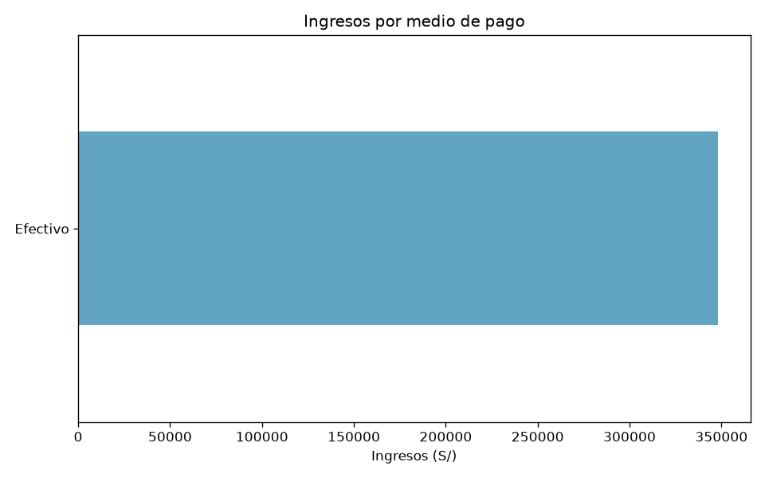
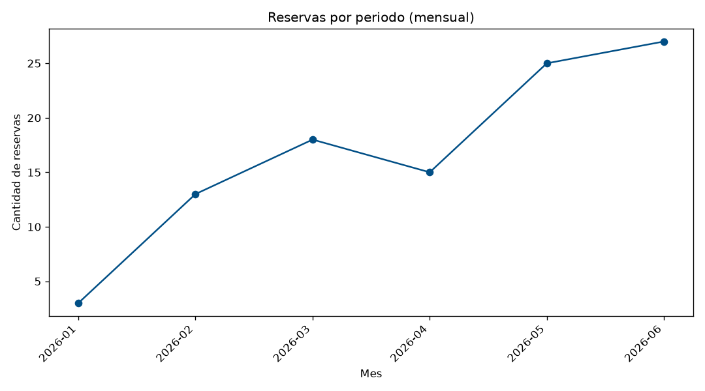
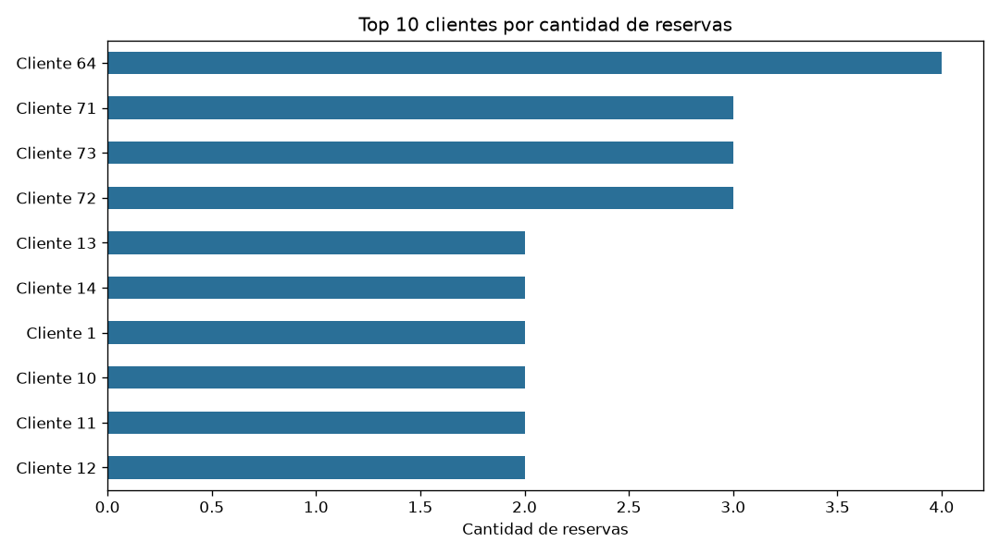
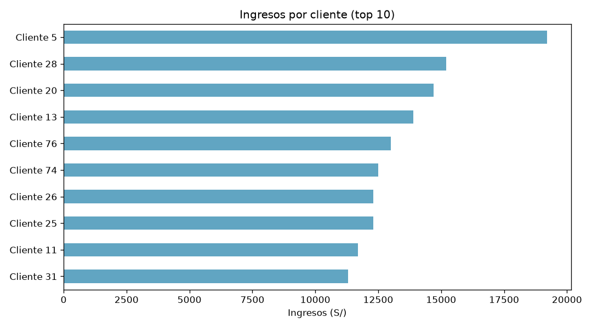
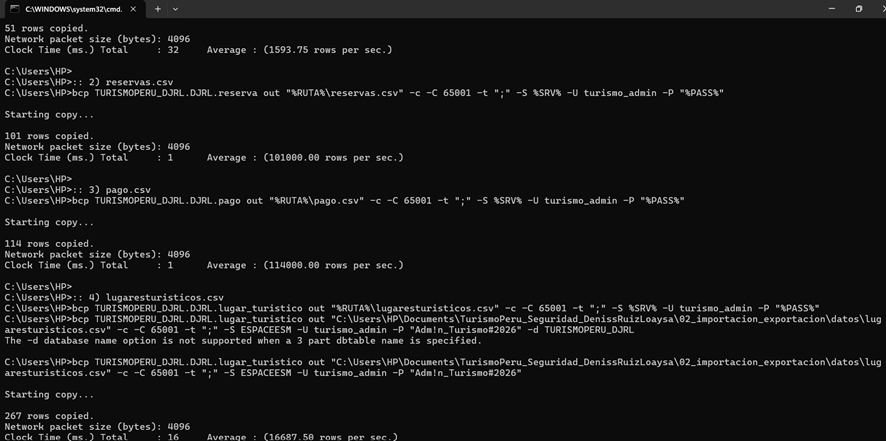
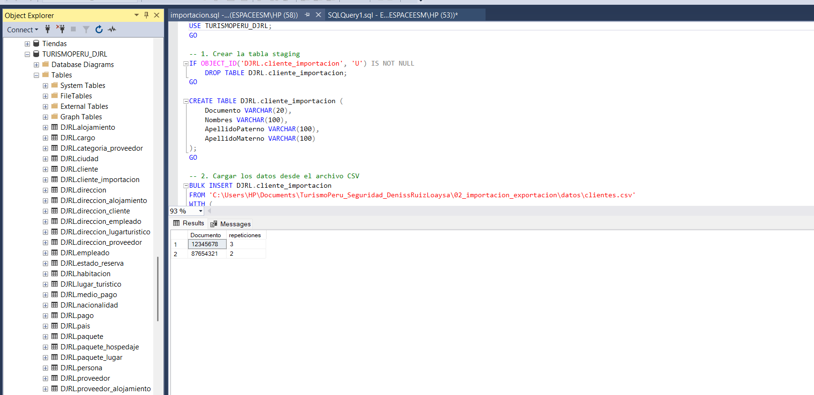
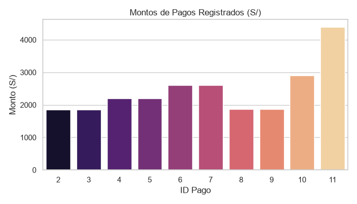
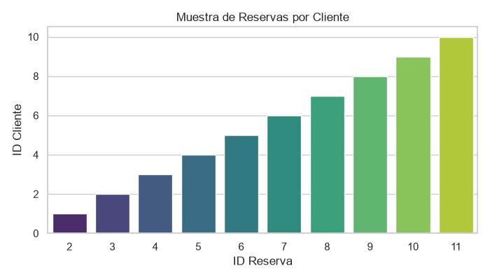

# 🔐 TurismoPeru – Administración y Seguridad de Base de Datos


Proyecto de administración y seguridad básica de la base de datos **TURISMOPERU_DJRL** (esquema `DJRL`). Implementa tres perfiles de usuario con permisos diferenciados, importación masiva de clientes con `bcp`, estrategia de respaldo y restauración, y un reporte analítico automatizado en Python.

## 📑 Contenido

1. [Descripción](#1-descripción)
2. [Tecnologías](#2-tecnologías)
3. [Requisitos](#3-requisitos)
4. [Instalación y configuración](#4-instalación-y-configuración)
5. [Estructura del repositorio](#5-estructura-del-repositorio)
6. [Scripts disponibles](#6-scripts-disponibles)
7. [Usuarios, roles y permisos](#7-usuarios-roles-y-permisos)
8. [Principio de mínimo privilegio](#8-principio-de-mínimo-privilegio)
9. [Importación con bcp](#9-importación-con-bcp)
10. [Backups y restauración](#10-backups-y-restauración)
11. [Reporte analítico en Python](#11-reporte-analítico-en-python)
12. [Evidencias](#12-evidencias)
13. [Autor](#13-autor)

---

## 1. Descripción

El proyecto cubre cuatro frentes sobre la base de datos de TurismoPeru:

- **Seguridad:** tres logins/usuarios (administrador, vendedor y analista) con roles y permisos de granularidad fina.
- **Importación:** carga masiva de clientes con `bcp` mediante una tabla de *staging*, con validación y control de duplicados.
- **Respaldo:** backups completo y diferencial, y exportación en formato `.bacpac`, con procedimiento de restauración.
- **Reportes:** script en Python que consulta clientes, reservas y pagos y genera 5 gráficos analíticos.

## 2. Tecnologías

| Herramienta | Uso |
|---|---|
| SQL Server 2022 / Express + SSMS | Motor y administración de la base de datos |
| `bcp` | Importación masiva desde línea de comandos |
| Git y GitHub | Control de versiones |
| Python 3.10+ | Reporte analítico |
| pandas, pyodbc, matplotlib, python-dotenv | Consulta, procesamiento y gráficos |

## 3. Requisitos

- SQL Server instalado y la base de datos `TURISMOPERU_DJRL` creada.
- SSMS y la utilidad `bcp` disponibles en el `PATH` del sistema.
- Git instalado.
- Python 3.10 o superior.
- ODBC Driver for SQL Server (necesario para `pyodbc`).

## 4. Instalación y configuración

```bash
# 1. Clonar el repositorio
git clone https://github.com/demixruizx-spec/TurismoPeru_Seguridad_DenissRuizLoaysa.git
cd TurismoPeru_Seguridad_DenissRuizLoaysa

# 2. Instalar dependencias de Python
pip install pandas pyodbc matplotlib python-dotenv

# 3. Crear el archivo de variables de entorno a partir del ejemplo
cp .env.example .env
```

Edita `.env` con tus credenciales (**nunca lo subas a GitHub**; ya está en `.gitignore`):

```env
DB_SERVER=NOMBRE_DEL_SERVIDOR
DB_DATABASE=TURISMOPERU_DJRL
DB_USER=turismo_analista
DB_PASSWORD=tu_contraseña
```

## 5. Estructura del repositorio

```text
TurismoPeru_Seguridad_DenissRuizLoaysa/
├── .env.example
├── .gitignore
├── README.md
├── 01_usuarios_roles/
│   ├── 01_logins.sql
│   ├── 02_users.sql
│   ├── 03_roles.sql
│   └── 04_permisos.sql
├── 02_importacion_bcp/
│   └── importacion.sql
├── 03_backups/
│   ├── backup_full.sql
│   ├── backup_diferencial.sql
│   └── restauracion.sql
├── 04_pruebas_seguridad/
│   └── pruebas_permisos.sql
├── 05_reportes/
│   └── python/
│       └── app.py
└── evidencias/
    ├── 01_reservas_por_estado.png
    ├── 02_ingresos_por_medio_pago.png
    ├── 03_reservas_por_periodo.png
    ├── 04_top10_clientes_reservas.png
    ├── 05_ingresos_por_cliente.png
    ├── Importacion.png
    ├── reporte_ingresos.png
    ├── reporte_reservas.png
    └── Validacion.png
```

## 6. Scripts disponibles

Ejecutar en el orden indicado.

| Script | Qué hace |
|---|---|
| `01_logins.sql` | Crea los tres logins del servidor: `turismo_admin`, `turismo_vendedor`, `turismo_analista`. |
| `02_users.sql` | Crea los usuarios asociados dentro de `TURISMOPERU_DJRL`. |
| `03_roles.sql` | Crea `rol_vendedor` y `rol_analista` y asigna sus miembros. |
| `04_permisos.sql` | Otorga y deniega permisos de granularidad fina por rol. |
| `importacion.sql` | Crea la tabla de staging, importa con `bcp`, valida registros e inserta solo los nuevos. |
| `backup_full.sql` / `backup_diferencial.sql` | Generan respaldos completo y diferencial. |
| `restauracion.sql` | Valida la estructura lógica y restaura en un entorno de pruebas. |
| `pruebas_permisos.sql` | Verifica la seguridad y simula accesos denegados. |
| `app.py` | Lee datos con `pyodbc` (credenciales desde `.env`) y genera 5 gráficos en `evidencias/`. |

## 7. Usuarios, roles y permisos

| Usuario | Rol | Alcance |
|---|---|---|
| `turismo_admin` | Administrador | Gestión completa de la base de datos |
| `turismo_vendedor` | `rol_vendedor` | Registrar y consultar clientes y reservas; **sin** `DELETE` sobre `DJRL.cliente` |
| `turismo_analista` | `rol_analista` | Solo lectura (`SELECT`) para generar reportes |

## 8. Principio de mínimo privilegio

No es adecuado asignar `db_owner` al vendedor ni al analista: ese rol otorga control total sobre el esquema y los datos (eliminar tablas, alterar la estructura, modificar permisos o administrar usuarios). Un vendedor solo necesita registrar y consultar clientes y reservas, y un analista únicamente lectura. Dar privilegios de más expone la base de datos a destrucción accidental o acceso no autorizado si se filtran las credenciales.

**Resultados de `pruebas_permisos.sql`:**

| Prueba | Usuario | Resultado esperado |
|---|---|---|
| `SELECT` sobre `DJRL.pago` | `turismo_analista` | ✅ Permitido |
| `INSERT` sobre `DJRL.pago` | `turismo_analista` | ❌ Rechazado (Error 229) |
| `DELETE` sobre `DJRL.cliente` | `turismo_vendedor` | ❌ Denegado |

## 9. Importación con bcp

Flujo utilizado para la carga masiva de clientes:

1. Se exportan los registros a un archivo CSV (`clientes_nuevos.csv`).
2. Se crea la tabla de staging `DJRL.cliente_importacion`.
3. Se ejecuta la importación con `bcp`.
4. Con SQL se filtran campos vacíos y se evitan duplicados por número de documento de identidad antes de insertar en `DJRL.cliente`.

```bash
bcp TURISMOPERU_DJRL.DJRL.cliente_importacion in "clientes_nuevos.csv" -c -t"," -r"\n" -S NOMBRE_DEL_SERVIDOR -U turismo_admin -P <TU_PASSWORD>
```

> 💡 Evita dejar la contraseña escrita en el historial de la terminal. Si usas autenticación de Windows, reemplaza `-U ... -P ...` por `-T`.

## 10. Backups y restauración

**Respaldos:** ejecutar `backup_full.sql` (completo) y `backup_diferencial.sql` (cambios desde el último completo).

**Restauración desde `.bak`** (`03_backups/restauracion.sql`):

1. Abrir el script en SSMS.
2. Inspeccionar los nombres lógicos de los archivos `.mdf` y `.ldf`:
   ```sql
   RESTORE FILELISTONLY FROM DISK = 'ruta\al\backup.bak';
   ```
3. Ejecutar `RESTORE DATABASE TURISMOPERU_TEST` redirigiendo los archivos con las cláusulas `MOVE ... TO ...`.

**Restauración desde `.bacpac`:** en SSMS, clic derecho sobre *Databases* → *Import Data-tier Application* y seleccionar `TurismoPeru_DJRL_Full.bacpac`.

## 11. Reporte analítico en Python

`05_reportes/python/app.py` se conecta con `pyodbc` usando las credenciales del archivo `.env` y genera cinco gráficos en formato PNG dentro de `evidencias/`.

```bash
python 05_reportes/python/app.py
```

Gráficos generados:

1. Reservas por estado
2. Ingresos por medio de pago
3. Reservas por periodo
4. Top 10 clientes por reservas
5. Ingresos por cliente

## 12. Evidencias

### Gráficos analíticos

| | |
|---|---|
|  |  |
|  |  |
|  | |

### Evidencias de operación

| Importación | Validación |
|---|---|
|  |  |

| Reporte de ingresos | Reporte de reservas |
|---|---|
|  |  |

## 13. Autor

**Deniss Jesus Ruiz Loaysa**
Escuela Profesional de Ingeniería de Sistemas
Universidad Nacional de Cajamarca
